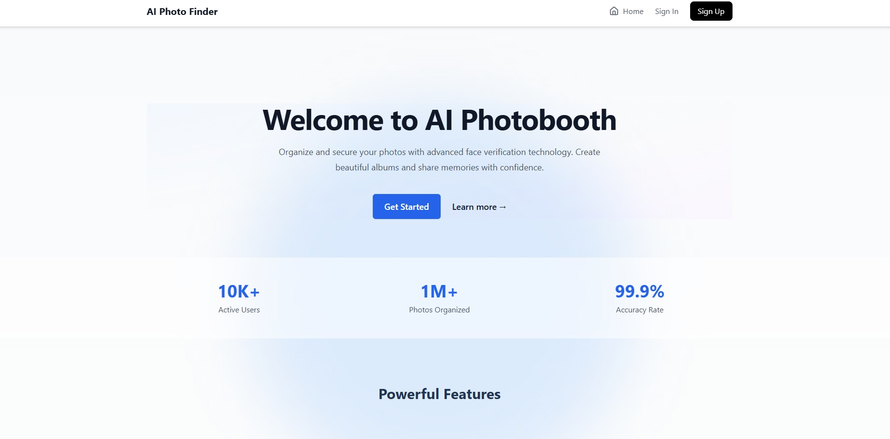

# AI Photo Finder

**AI Photo Finder** is a web app that helps cameras and event photographers streamline photo delivery with AI-powered face recognition. At a large event—like a university convocation or family gathering—hundreds of group and individual shots are taken. Now visitors can quickly find and download their photos using just one sample image.

🔗 **Live Website**: [Ai Photo Finder](https://photofinder.phigalaxy.com/)

---

## Why We Built This

Photographers often face delayed requests and confusion when delivering thousands of pictures. Smart Photo Finder solves this by:

1. Allowing users to search using their own photo.
2. Automatically locating and returning all related images—single or group shots.
3. Saving hours of manual sorting and emailing each photo.

**AI Photo Finder** bridges that gap with automation and intelligence.

---

## Main Features

### For Event Attendees
- Upload a selfie or personal photo for instant search.
- View a gallery of matched images—single or group shots.
- Download selected photos directly from your device.

### For Photographers
- Upload event galleries in bulk.
- Rely on face recognition to sort images automatically.
- Reduce manual customer interaction—instant access improves satisfaction.

---

## Tech Stack

## 🛠 Tech Stack

- **Frontend**: React (responsive across desktop, tablet & mobile)  
- **Backend**: Flask API (Python 3.10+)  
- **AI / Vision**: dlib + Face Recognition pre-trained models  
- **Vector Database**: FAISS for scalable similarity search  

Responsive across **desktop, tablet, and mobile**.

---

## Demo Screenshots

| Desktop Demo-1 | Desktop Demo-2 |
|--------------|-------------|
|  |  |

**Video Demo**: [Watch on Google Drive](https://drive.google.com/file/d/1kNqZJOCZfThBXK-FyzlNtbjpNcSACU6J/view?usp=drive_link)

---

## Prerequisites

Before running locally, ensure:

- [Git](https://git-scm.com/downloads) is installed
- Python 3.10+ environment setup

---

## Demo Flow

1. Photographer uploads entire event gallery.  
2. Attendee visits site and clicks “Find My Photos.”  
3. Attendee uploads a personal photo.  
4. FaceAI processes the image and searches gallery via FAISS.  
5. Matched images are displayed—downloadable in bulk or one by one.

## Business Opportunity

This AI tool is ready for integration into:

-  Company Career Portals  
-  Recruitment Agency Platforms  
-  HR Tech SaaS Products  

Use it to:

-  Save countless hours of manual screening  
-  Improve hiring with data-driven decisions  
-  Boost applicant success with smarter CVs  

---

## Get In Touch

Interested in licensing, integration, or collaboration?

➡️ Message me directly  
➡️ Comment **"AI Photo Finder"**  
➡️ Or connect here:

-  Email: [himel35-1078@diu.edu.bd](mailto:himel35-1078@diu.edu.bd)  
-  LinkedIn: [Tasrif Nur Himel](https://www.linkedin.com/in/tasrifnurhimel/)
-  Facebook: [Himel Tasrif](https://www.facebook.com/himeltasrif06)

---

## License & Credits

© 2025 [Tasrif Nur Himel](https://www.tasrifnurhimel.me). All rights reserved.

Licensed under the [MIT License](./LICENSE).

---

